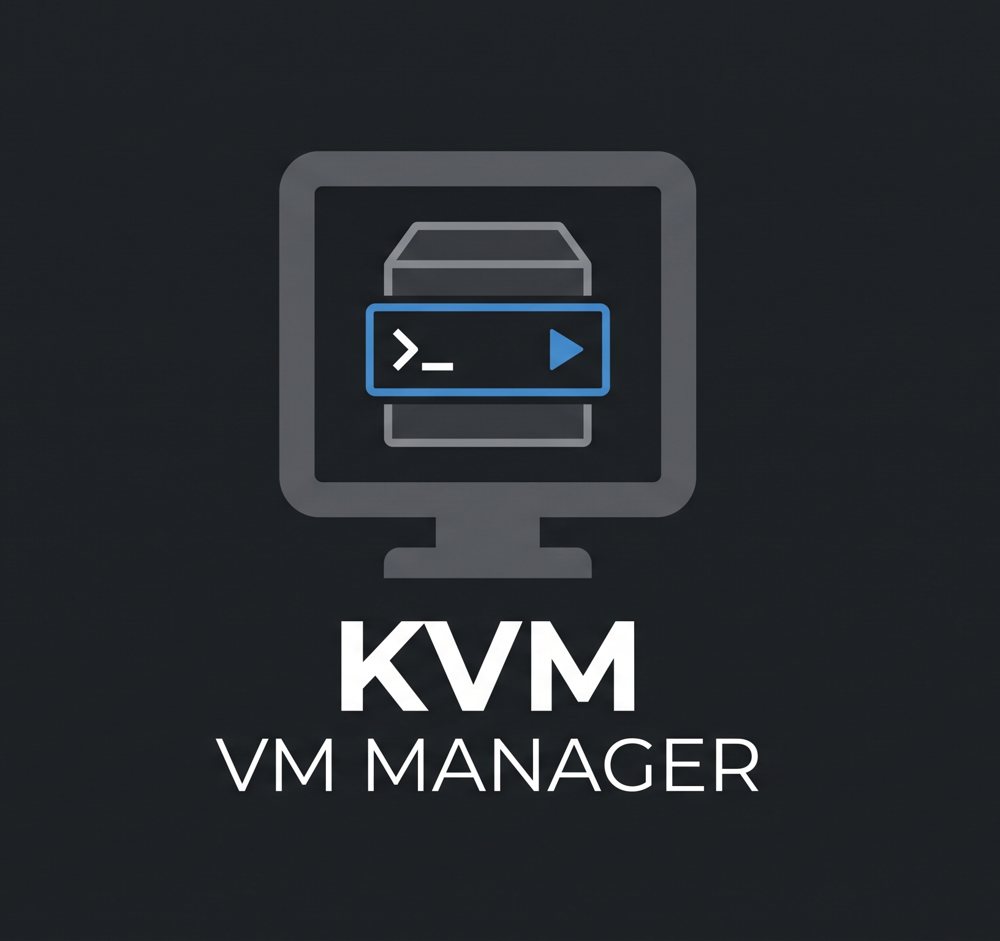

<div align="center">



# KVM VM Manager

Gerenciador desktop leve para máquinas virtuais KVM/QEMU utilizando libvirt, com interface gráfica, CLI, mini widget e atalhos individuais para cada VM.


</div>

---

## 🖥️ Sobre o Projeto

O **KVM VM Manager** é uma aplicação desktop desenvolvida em Python para facilitar o gerenciamento de máquinas virtuais locais utilizando **KVM/QEMU + libvirt**.

O projeto permite iniciar, desligar, reiniciar, conectar e criar VMs sem depender da janela principal do `virt-manager`, além de oferecer um mini widget individual para acesso rápido às máquinas virtuais.

---

## 🚀 Tecnologias & Ferramentas

### Aplicação

- **Python** - Linguagem principal
- **CustomTkinter** - Interface gráfica desktop
- **Pillow** - Manipulação de imagens e ícones
- **Tkinter** - Base da interface gráfica

### Virtualização

- **KVM / QEMU** - Virtualização
- **libvirt** - Gerenciamento das máquinas virtuais
- **virsh** - Controle das VMs pela linha de comando
- **virt-install** - Criação de novas máquinas virtuais
- **virt-viewer** - Acesso gráfico às VMs
- **libosinfo** - Identificação e perfis de sistemas operacionais

### Conectividade

- **SSH** - Acesso remoto a máquinas Linux
- **AnyDesk** - Conexão remota opcional
- **SPICE / VNC** - Console gráfico através do virt-viewer

<p align="center">
  
</p>

---

## ✨ Funcionalidades

- **Gerenciamento de VMs**: Liste, inicie, desligue e reinicie máquinas virtuais
- **Interface Gráfica**: Painel desktop desenvolvido com CustomTkinter
- **Atualização Incremental**: Atualiza status das VMs sem reconstruir toda a interface
- **Mini Widget**: Controle uma VM através de uma pequena janela flutuante
- **Conexão Direta**: Abra VMs com virt-viewer, SSH ou AnyDesk
- **Atalhos Individuais**: Crie atalhos na área de trabalho para abrir diretamente o widget de uma VM
- **Criação de VMs**: Crie novas máquinas utilizando imagens ISO locais
- **Catálogo de Sistemas**: Suporte a diferentes distribuições Linux e versões do Windows
- **Detecção de SO**: Integração com libosinfo quando disponível
- **CLI**: Controle as VMs diretamente pelo terminal
- **Configuração por VM**: Defina o método de conexão individualmente
- **Ícones Simples**: Windows utiliza sua própria imagem e sistemas Linux utilizam um ícone genérico de Linux

---

## ⚡ Instalação

### Pré-requisitos

Antes de instalar, o sistema precisa possuir:

- Python 3.10+
- KVM / QEMU
- libvirt
- `virsh`
- `virt-install`
- `virt-viewer`
- suporte do Python ao Tk

O usuário também precisa conseguir acessar o libvirt através de:

```bash
virsh -c qemu:///system list --all
```

### Instalação automática

1. Clone o repositório:

```bash
git clone https://github.com/matheusenalt/kvm-vm-manager.git
cd kvm-vm-manager
```

2. Dê permissão de execução ao instalador:

```bash
chmod +x install.sh
```

3. Instale:

```bash
./install.sh
```

O instalador:

- verifica as dependências essenciais do sistema
- verifica a conexão com `qemu:///system`
- cria um ambiente virtual Python privado
- instala o `requirements.txt`
- instala o projeto em `~/.local/share/kvm-vm-manager`
- cria o comando `kvm-vm-manager`
- registra o aplicativo no menu do ambiente desktop
- preserva o `config/config.json` durante atualizações

Depois da instalação, procure por **KVM VM Manager** no menu de aplicativos ou execute:

```bash
kvm-vm-manager
```

---

## 🧪 Executar sem Instalar

Crie um ambiente virtual:

```bash
python -m venv .venv
source .venv/bin/activate
```

Instale as dependências Python:

```bash
pip install -r requirements.txt
```

Inicie a aplicação:

```bash
python src/main.py
```

Também é possível iniciar diretamente a interface:

```bash
python src/gui.py
```

---

## 🎛️ Mini Widget

Abra o widget de uma VM:

```bash
kvm-vm-manager win10 --widget
```

Ou, executando diretamente pelo código-fonte:

```bash
python src/main.py win10 --widget
```

O widget permite:

- iniciar a VM
- desligar a VM
- reiniciar a VM
- visualizar o status
- visualizar o tipo de conexão
- conectar à VM

A conexão utiliza automaticamente a configuração definida para aquela máquina.

---

## 🖇️ Atalhos na Área de Trabalho

Crie um atalho para uma VM através da CLI:

```bash
kvm-vm-manager win10 shortcut
```

Ou pelo código-fonte:

```bash
python src/main.py win10 shortcut
```

O atalho abre diretamente o mini widget da VM correspondente.

Também é possível criar ou remover o atalho através das configurações da VM na interface gráfica.

---

## 🔌 Tipos de Conexão

### Interface gráfica

```json
{
  "win10": {
    "os": "windows10",
    "connection": "ui"
  }
}
```

Abre a máquina através do `virt-viewer`.

### SSH

```json
{
  "ubuntu-server": {
    "os": "ubuntu",
    "connection": "ssh",
    "user": "your-user"
  }
}
```

### AnyDesk

```json
{
  "windows-remote": {
    "os": "windows11",
    "connection": "anydesk",
    "address": "YOUR_ANYDESK_ID"
  }
}
```

> O arquivo `config/config.json` contém configurações locais e não deve ser enviado para o repositório público. Utilize `config/example.json` como modelo.

---

## 💿 Sistemas Operacionais

A criação de VMs possui opções para diferentes sistemas Linux e Windows.

Entre os perfis disponíveis estão:

- Ubuntu
- Debian
- Linux Mint
- Fedora
- Arch Linux
- Manjaro
- Kali Linux
- Parrot OS
- Rocky Linux
- AlmaLinux
- CentOS Stream
- openSUSE
- Alpine Linux
- Gentoo
- NixOS
- Pop!_OS
- elementary OS
- Zorin OS
- MX Linux
- EndeavourOS
- Void Linux
- Oracle Linux
- Slackware
- Mageia
- Clear Linux
- Tails
- Qubes OS
- Windows 10
- Windows 11
- Windows Server
- Other Linux / Generic ISO

A lista não funciona como uma whitelist. Para consultar os sistemas conhecidos pelo `libosinfo` instalado no computador:

```bash
kvm-vm-manager list-os
```

---

## 🎨 Ícones

Os ícones padrão ficam dentro de:

```text
assets/
├── app-icon.png
├── windows.png
└── linux.png
```

- `app-icon.png` - logo do KVM VM Manager
- `windows.png` - máquinas Windows
- `linux.png` - máquinas Linux

Isso mantém o projeto simples e permite que os usuários substituam as imagens caso desejem personalizar a instalação.

---

## 💻 CLI

### Listar VMs

```bash
kvm-vm-manager list
```

### Status de uma VM

```bash
kvm-vm-manager win10 status
```

### Iniciar

```bash
kvm-vm-manager win10 start
```

### Desligar

```bash
kvm-vm-manager win10 shutdown
```

### Reiniciar

```bash
kvm-vm-manager win10 reboot
```

### Conectar

```bash
kvm-vm-manager win10 connect
```

### Iniciar e conectar

```bash
kvm-vm-manager win10 launch
```

### Criar atalho

```bash
kvm-vm-manager win10 shortcut
```

### Abrir widget

```bash
kvm-vm-manager win10 --widget
```

---

## 📁 Estrutura do Projeto

```text
kvm-vm-manager/
├── assets/
│   ├── app-icon.png
│   ├── windows.png
│   └── linux.png
├── bin/
│   └── kvm-vm-manager
├── config/
│   ├── config.json
│   └── example.json
├── packaging/
│   └── kvm-vm-manager.desktop
├── src/
│   ├── ui/
│   │   ├── dialogs/
│   │   │   ├── create_vm.py
│   │   │   └── vm_settings.py
│   │   ├── assets.py
│   │   ├── main_window.py
│   │   ├── theme.py
│   │   └── vm_card.py
│   ├── connection.py
│   ├── desktop_shortcuts.py
│   ├── gui.py
│   ├── launcher.py
│   ├── main.py
│   ├── os_catalog.py
│   ├── vm_manager.py
│   └── widget.py
├── install.sh
├── uninstall.sh
├── requirements.txt
├── LICENSE
└── README.md
```

---

## 🗑️ Desinstalação

Para remover a instalação realizada pelo `install.sh`:

```bash
./uninstall.sh
```

---

## 🔒 Configuração Privada

O arquivo:

```text
config/config.json
```

deve permanecer local.

Não publique:

- IDs reais do AnyDesk
- credenciais
- usuários sensíveis
- chaves SSH
- tokens
- informações privadas de infraestrutura

O repositório público deve utilizar:

```text
config/example.json
```

---

## 💻 Linguagem Utilizada

- **Python** - aplicação, interface gráfica, CLI e integração com libvirt
- **Shell** - instalação e desinstalação do aplicativo

---

## 📄 Licença

Este projeto está sob a licença MIT.

---

## 👨‍💻 Autor

<div align="center">

[<br><sub>Matheus</sub>](https://github.com/matheusenalt)

</div>
